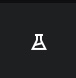

# Lending Club

[](https://kedro.org)

## Overview

Landing Club dataset provides information about loans issued to the individuals and related data from loan applications submitted on loan request date. This project aims to make a model, using machine learning techniques, that will predict whether the loan will be defaulted or not based on information provided in loan applications.

For this project Kedro framework with Kedro-Viz setup was used. Take a look at the [Kedro documentation](https://docs.kedro.org) to get started.

## Notebooks

See my workflow description and report in Jupyter notebooks in `notebooks` folder.


## Project dependencies

Install the project requirements with `pip install -r requirements.txt`.


## How to run Kedro pipeline

You should run Kedro project with:

```
kedro run
```

After completion of all pipelines' steps two models will be created and saved in `data\6_models` folder in a specific version subfolder: baseline and candidate.

## Visualization with Kedro

To see the pipelines or metrics of each model you can run Kedro-viz:

```
kedro viz
```

Click to Experiment tracking to see metrics and confusion matrices:

